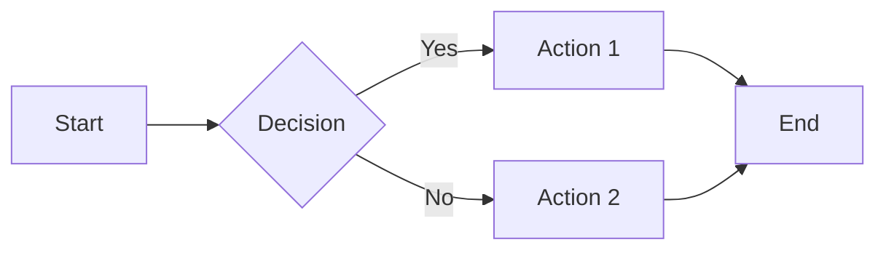
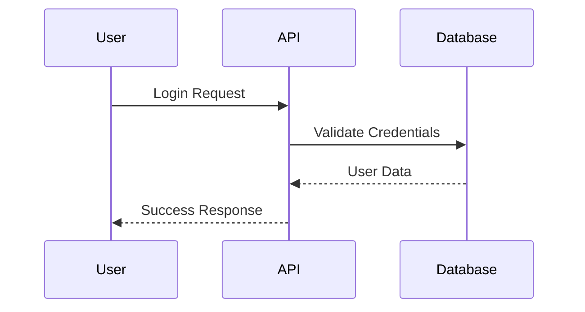
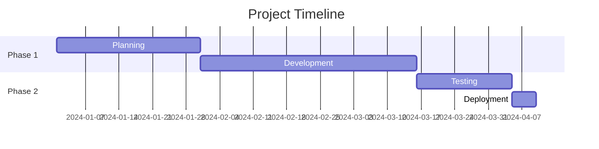
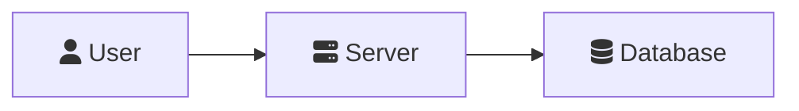

# satware® AI Mermaid Plugin

A TypingMind plugin for rendering Mermaid diagrams with comprehensive syntax support, icon packs, and ZenUML integration.

## Features

- **Mermaid.js v11.6** - Latest stable version with all diagram types
- **ZenUML Support** - Sequence diagrams with ZenUML syntax
- **Icon Packs** - Built-in support for multiple icon libraries:
  - Technology & Brand Logos (`logos`, `simple-icons`)
  - Material Design Icons (`mdi`)
  - Font Awesome 6 (`fa6-solid`, `fa6-regular`, `fa6-brands`)
- **Dark Mode** - Automatically adapts to theme
- **Error Handling** - Clear error messages for syntax issues
- **Responsive** - Mobile-friendly diagram rendering

## Supported Diagram Types

### Stable Diagrams
- Flowchart (`flowchart TD/LR`)
- Sequence Diagram (`sequenceDiagram`)
- Class Diagram (`classDiagram`)
- State Diagram (`stateDiagram-v2`)
- Entity Relationship (`erDiagram`)
- User Journey (`journey`)
- Gantt (`gantt`)
- Pie Chart (`pie`)
- Quadrant Chart (`quadrantChart`)
- Requirement Diagram (`requirementDiagram`)
- Gitgraph (`gitGraph`)
- Mindmap (`mindmap`)
- Timeline (`timeline`)

### Beta/Experimental Diagrams
- XY Chart (`xychart-beta`)
- Sankey Diagram (`sankey-beta`)
- Packet Diagram (`packet-beta`)
- Architecture (`architecture-beta`)
- Radar Chart (`radar-beta`)

## Installation

1. Open TypingMind
2. Go to **Plugins** section
3. Click **Add Plugin**
4. Choose **From GitHub URL**
5. Enter: `https://github.com/satwareAG/mermaid-plugin`
6. Click **Install**

## Usage

### Basic Example

Ask the AI to create a diagram:

```
Create a flowchart showing the user registration process
```

The AI will invoke the plugin with appropriate Mermaid syntax.

### Manual Invocation

You can also manually invoke the function:

```json
{
  "function": "render_mermaid_diagram",
  "parameters": {
    "title": "User Registration Flow",
    "source": "flowchart TD\n    Start[User Opens App] --> Register[Registration Form]\n    Register --> Validate{Valid Input?}\n    Validate -->|Yes| Create[Create Account]\n    Validate -->|No| Error[Show Error]\n    Error --> Register\n    Create --> Success[Registration Complete]"
  }
}
```

### Diagram Examples

#### Flowchart


#### Sequence Diagram


#### Gantt Chart


## Icon Usage

Use icons in diagrams with the following syntax:



Available icon packs:
- `logos:*` - Technology logos (e.g., `logos:react`, `logos:nodejs`)
- `simple-icons:*` - Brand icons (e.g., `simple-icons:github`)
- `mdi:*` - Material Design (e.g., `mdi:account`, `mdi:server`)
- `fa6-solid:*` - Font Awesome Solid
- `fa6-regular:*` - Font Awesome Regular
- `fa6-brands:*` - Font Awesome Brands

Find icons at: [icones.js.org](https://icones.js.org)

## Technical Details

### Dependencies
- **Mermaid.js**: v11 (ESM module from CDN)
- **ZenUML Plugin**: v0.2.0
- **Iconify JSON**: v1 (multiple packs)

### Plugin Specification
- **Function Name**: `render_mermaid_diagram`
- **Output Type**: `render_html`
- **Parameters**:
  - `title` (string, required): Diagram title
  - `source` (string, required): Mermaid diagram source code

### Browser Compatibility
- Modern browsers with ES Module support
- Chrome 61+, Firefox 60+, Safari 11+, Edge 79+

## Context Instructions

The plugin includes comprehensive Mermaid v11.6 syntax requirements that guide the AI in generating valid diagrams. This ensures:
- Correct diagram prefixes
- Proper node syntax
- Valid relationship definitions
- Error-free rendering

## Troubleshooting

### Diagram Not Rendering
1. Check diagram prefix is correct (e.g., `flowchart TD`, not `graph TD`)
2. Ensure node IDs are unique
3. Verify relationship syntax
4. Check for circular references (not allowed in most diagrams)

### Parse Errors
Parse errors are displayed below the diagram area with detailed error messages. Common issues:
- Missing quotes around labels with spaces
- Invalid node IDs
- Incorrect relationship syntax
- HTML tags in node definitions (not allowed)

## License

MIT License - See [LICENSE](LICENSE) file for details

## Author

**satware AG**
- Website: [satware.ai](https://satware.ai)
- GitHub: [@satwareAG](https://github.com/satwareAG)

## Support

For issues or questions:
- Open an issue on [GitHub](https://github.com/satwareAG/mermaid-plugin/issues)
- Contact: info@satware.com

## Version

Current version: 1.0.0

## Resources

- [Mermaid.js Documentation](https://mermaid.js.org/)
- [TypingMind Plugins Docs](https://www.typingmind.com/plugins-docs)
- [Icon Search](https://icones.js.org)
